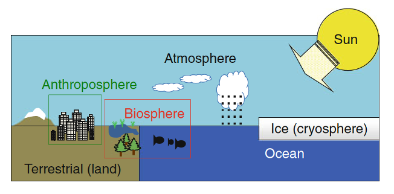
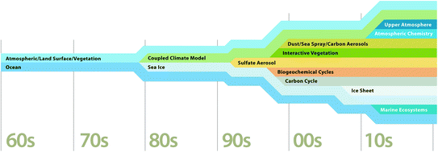
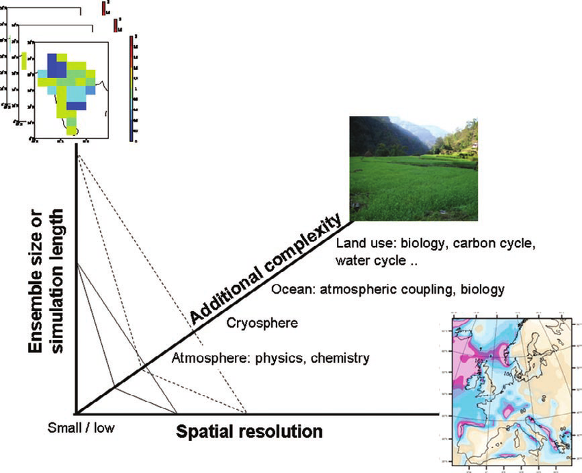

### What is a Model?
* Representation of a system or object
* Examples: Models of a building
  * Small scale physical model
  * Blueprint
  * Simulation of how the building will react during an Earthquake
These depend on uncertain inputs and the prediction of how the building will look, function, or cost are predictions.

### What is a Climate/Earth System Model?

* A computer program of equations following the laws of physics describing the evolution of the atmosphere, ocean, land, and other components
* Solved in cells or grid boxes
* The physical laws provide contraints on how the model can evolve (e.g.conservation of mass).
* In practice, each component of the Climate System is a separate program.  
* Componenets share information as needed (i.e. coupling)
A climate scientist's laboratory. 

### What are the parts of the Climate System that we want to model?

*from [Gettelman A., Rood R.B. 2016 https://doi.org/10.1007/978-3-662-48959-8_2](https://link.springer.com/chapter/10.1007/978-3-662-48959-8_2#citeas)*

*from [Gettelman A., Rood R.B. 2016 https://doi.org/10.1007/978-3-662-48959-8_2](https://link.springer.com/chapter/10.1007/978-3-662-48959-8_2#citeas)*

Each of these component have many details!  This gets complicated! We must balance resolution, complexity, sample size (ensemble size or simulation length) with the resources of a large supercomputer. Earth system models demand significant computer resources even for a supercomputer!

*from [Challinor et al. 2009, DOI: 10.1175/2008BAMS2403.1](https://journals-ametsoc-org.mutex.gmu.edu/bams/article/90/6/836/59635/Methods-and-Resources-for-Climate-Impacts)*

### What types of Experiments can I do with Earth System Models to answer science questions?

There are three broad categories of experiments:
1. Simulation: what the model thinks the climate looks like under certain conditions
2. Projection: what the model thinks the climate will look like in the future under different scenarios
3. Prediction: a forecast for a specific date given initial conditions

> ## Scientific Questions and model experiments
> Below are some scientific questions.  In your breakout group, discuss which kind of experiment could be used to answer the question. Note that the categories are not mutually exclusive and there is not necessarily a single correct answer for each one.
> 
> 1. How well does a model predict the recent heatwave in CA?
> 2. How well would a model predict the heatwave in CA if we knew the sea surface temperature perfectly throughout the forecast?
> 4. How well does a particular model simulate the climate variability over the last 100 years?
> 5. Are changes in the number of heatwaves in a model over time due to global warming or internal variability?
> 6. Would the precipitation in a model be better represented if I made an improvement to the convective parameterization?
> 7. How uncertain is future  precipitation given a "business as usual" scenario?
>
> 
{: .challenge}

### What will we learn about Earth System Models in this class?
Climate models are developed by large teams of scientists (100s of people) who spend their entire careers on this. Most model developers are experts in their one piece of the modeling system.   It is not possilble to learn all the complicated details of a climate model. This class takes a practical approach.

_At the end of this course,learners will be able to:_
* Design and Run Earth System Model experiments for hypothesis driven research
* Identify different types of experiments from Earth System models and what they can tell us
* Analyze the output of an Earth System Model appropriately for a given type of experiment
* Utilize a high-performance computing system for performing Earth System Model experiments
* Use an Earth System model in their research
 


